# Whiteboard architecture (canonical)

Source: agency whiteboard — entities, roles, lifecycle, and rules.

## Entities

| Whiteboard | PMS implementation |
|------------|-------------------|
| Admin | `agency_admin` workspace role |
| Member | `User` + `WorkspaceMember` |
| Lead | `Lead` + `LeadActivity` + `LeadFile` |
| Contact | `Client` (converted account; lead record retained) |
| Project | `Project` + `ProjectMember` + milestones + tasks |

## Roles (workspace + per-project)

| Whiteboard | PMS workspace role | Project `ProjectMember.role` |
|------------|-------------------|------------------------------|
| Sales | `sales` | — |
| PM | `project_manager` | `project_manager` |
| Designer | `ux_designer` | `ux_designer` |
| PE | `product_engineer` | `product_engineer` |
| QA | `qa_engineer` | `qa_engineer` |
| Client | `client` | — |

**Rule:** A member may hold different project roles on different projects (via `ProjectMember`).

## Responsibilities

- **Sales** — CRUD leads; convert to client (contact). No delivery projects.
- **Admin** — Lead → won path: proposals on lead, create client, create draft project, assign PM, publish when ready.
- **PM** — Requirements from proposal; assign Designer / PE / QA on project; milestones and subtasks; submit to client after QA sign-off.
- **Designer / PE / QA** — Complete assigned tasks under active milestone by deadline.
- **QA** — Sign off milestone after internal delivery complete, before client review.
- **Client** — Published projects only; milestone progress; milestone review; payment status visible; plan concern notes.

## Lifecycle (happy path)

```mermaid
flowchart LR
  lead[Lead]
  log[Lead log]
  proposal[Proposal files]
  won[Won]
  client[Client]
  draft[Draft project]
  pm[Assign PM and team]
  work[Tasks per milestone]
  internal[Internal complete]
  qa[QA sign-off]
  review[Client review]
  pay[Paid]
  next[Next milestone]

  lead --> log
  log --> proposal
  proposal --> won
  won --> client
  client --> draft
  draft --> pm
  pm --> work
  work --> internal
  internal --> qa
  qa --> review
  review --> pay
  pay --> next
```

1. Lead ingested; notes and proposals logged on lead timeline.
2. Proposal accepted → convert to **client** (not auto-project).
3. Admin/PM runs **Create project & share proposals** → draft project + promoted files.
4. Assign PM (if not creator) and Designer / PE / QA as `ProjectMember`.
5. **Publish** to client portal when plan + client-visible files ready.
6. Per milestone: tasks (sequential, PM-approved) → PM marks **internal complete** → **QA sign-off** → PM sends **client review** → client approves → mark **paid** → unlock next milestone.

## System rules

1. **Visibility** — `agency_admin` sees all workspace projects. Sales sees leads/clients only. PM, Designer, PE, QA see only projects where they are `ProjectMember`.
2. **Audit** — Lead timeline, project plan log, milestone reviews, task reviews; extend with `ProjectActivity` over time.
3. **Concurrent projects** — One client, many projects (supported).
4. **Payment** — Next milestone stays `locked` until current milestone `paymentStatus` is `paid` (after client completion).

## Implementation map

| Area | Status |
|------|--------|
| Lead + log + files | Done |
| Convert → client only | Done |
| Handoff wizard + publish gate | Done |
| Project member scoping | Done |
| QA sign-off before client review | Done |
| Payment gates next milestone | Done |
| Admin assigns PM on handoff | Done |
| Role-aware dashboard | Done |
| Portal payment CTA | Done |
| Full project activity audit | Backlog |
